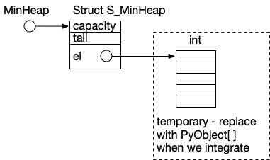

# Notes on minheap data structure for CPython

## Fixed and variable part

Rather than including the array of elements directly in the minheap
structure, I think we will want it to be a pointer to an array
of elements.  The reason for this is so that we can grow the
elements array if we exceed capacity.  This means initially that
we will need two mallocs to create a minHeap structure.  We will
allocate the `struct S_MinHeap` (a fixed size) and separately malloc
the `int []` structure with `capacity` elements. 

## Reallocation

When we insert an element into the heap and discover that we
don't have enough capacity, we will want to allocate a new,
bigger array, copy all the old elements, and deallocate (`free`)
the old elements array.  (I think this will be very similar to
reallocation of `list` structures in CPython, so we might follow
the example of `list` regarding how much larger to make the
newly allocated array.)

## Integrating with CPython

The fixed part (`struct S_MinHeap`) might fit right inside a
PyObject structure and be allocated along with it.
I'm not certain of that, but we can look at `list` for an example.

We'll want to change the `el` array of int into an array of
`PyObject`.  That will probably mean incrementing and decrementing
reference counts.  The `append` and `pop` operations on `list` should
give us good examples of when we should update reference counts.
(For example, it isn't obvious to me whether `extract`, which is
currently called `deleteMin`, should decrement the reference count,
since that reference will be in the return value.) 

